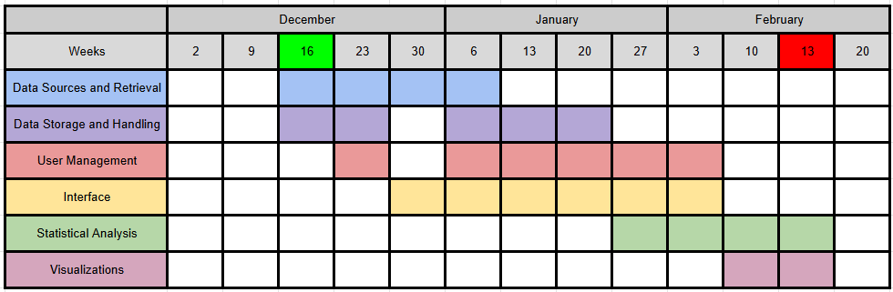

# Description
A web-based project that simulates a hospital and its patients

# Functionalities

## Data Sources and Retrieval
- Retrieve data from an extensive, high-quality data set like [MIMIC-IV](https://www.nature.com/articles/s41597-022-01899-x):
  - real data sourced from the electronic health record of the Beth Israel Deaconess Medical Center
  - very extensive data set that requires advanced data cleaning and evaluation based on our requirements
  - can be adjusted to our custom database architecture
  - access requires a completed training course in research with human participants and a signed DUA
  - access is provided via PhysioNet
  - additional information (e.g. Billing, Administration, advanced medical information, etc.) allows us to add extra functions and expand the software's functions $${\color{pink}(Low \space priority)}$$
- Generate a data set for the necessary doctors so patients can be assigned to them accordingly

## Data Storage and Handling
- Store the data from the external source in an SQL database
  - create a concept for the database architecture and necessary information required for the software
- Store Log-In information by hashing passwords
  - use built-in library like [hashlib](https://docs.python.org/3/library/hashlib.html)
  - because our passwords don't need to be moved or send to another server but only stored in our database, hashing is a good choice to safeguard sensible information

## User Management
- Log-In system
  - Patients
    - view and modify **only** their data
    - view a doctors profile
  - Admins
    - view-only access to all profiles
    - able to modify data upon user request
    - also used for data analysis purposes
    - Create/Delete accounts upon request
  - Doctors $${\color{pink}(Low \space priority)}$$
    - view **only** their patients data and add medical data to their profile (patients that are assigned to them)
    - view a doctors profile
    - view and modify their own profile
- Create a concept for data protection $${\color{pink}(Low \space priority)}$$
  - What happens when an account is deleted? 
  - anonymization of users during data analysis
  
## Interface
- Create a website
  - Log-In portal
    - new users get an email confirmation upon registration
  - Home screen, profile view, change personal data, support page, impressum, etc.
  - depending on user the home screen and available functions change
- Admin view to modify profiles
- Timed Log-Out
- Dashboard for results of data analysis
 
## Statistical Analysis
- Users can access a dashboard that displays analysed data
  - Patients can view data regarding their own medical conditions and medications
  - Admins can view and provide filtered (and anonymized) statistics to all users
    - basic statistics like frequency of specific illnesses or conditions across all patients (or a specific age/gender/etc. group)

## Visualizations
- Display the data from [Statistical Analysis](#statistical_analysis) with simple graphs
  - add an interactive graph to filter for $${\color{pink}(Low \space priority)}$$
    - patient profiles (age, gender, etc.)
    - time periods
    - medical conditions, medications, etc. \

# Installation and Usage
## SQL Server Setup
The system requires a working instance of our database running on your local machine. Restore the [database backup] (database1.zip) according to the official [Quickstart guide] (https://learn.microsoft.com/en-us/sql/relational-databases/backup-restore/quickstart-backup-restore-database?view=sql-server-ver16&tabs=ssms).  

# Timeline

# Group Details

- Group name: Lank
- Group code: G12
- Group repository: https://github.com/lefischerander/Lank
- Tutor responsible: Jonas Rieling
- Group team leader: Leander Fischer
- Group members: Konstantin Kolbek, Erik Schäfer, Nantenaina Razafindraibe

# Acknowledgements
## MIMIC-IV
- MIMIC-IV Clinical Database Demo https://physionet.org/content/mimic-iv-demo/2.2/
- Johnson, A., Bulgarelli, L., Pollard, T., Gow, B., Moody, B., Horng, S., Celi, L. A., & Mark, R. (2024). MIMIC-IV (version 3.1). PhysioNet. https://doi.org/10.13026/kpb9-mt58
- MIMIC Online Documentation https://mimic.mit.edu/
